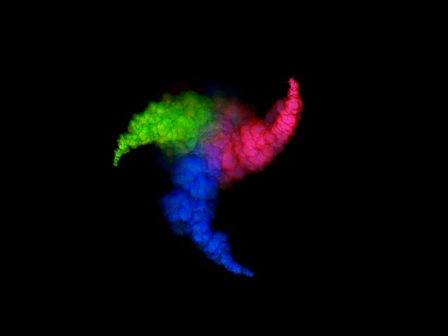



## Create Fire Smoke Explode

### Description

Introduction: EngineAAK Ver 1.1

Create Fire Explode Smoke use Direct 3D
 
### More Info
 

             |
---                |---
**Submitted On**   |2005-10-15 01:39:10
**By**             |[A Andik\. Krist\.](https://github.com/Planet-Source-Code/PSCIndex/blob/master/ByAuthor/a-andik-krist.md)
**Level**          |Beginner
**User Rating**    |4.6 (37 globes from 8 users)
**Compatibility**  |VB 6\.0
**Category**       |[Graphics](https://github.com/Planet-Source-Code/PSCIndex/blob/master/ByCategory/graphics__1-46.md)
**World**          |[Visual Basic](https://github.com/Planet-Source-Code/PSCIndex/blob/master/ByWorld/visual-basic.md)
**Archive File**   |[Create\_Fir19405010152005\.zip](https://github.com/Planet-Source-Code/a-andik-krist-create-fire-smoke-explode__1-62897/archive/master.zip)

